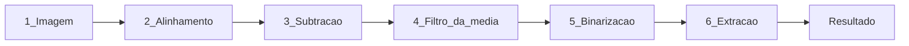

# Circuit Inspector

Compara duas fotos de um circuito em protoboard — **gabarito** e **circuito do aluno** — e destaca a divergencia principal de posicionamento.

- **Frontend:** https://vision-circuit-inspector.vercel.app/
- **API:** https://circuit-inspector-api-626213504873.us-central1.run.app/

## Como funciona (resumo)



O modo padrao usa **registro automatico** (zero clique): alinha as fotos, compara ocupacao por cor e reporta **uma divergencia principal** por placa.

Detalhes de cada etapa: [docs/pipeline.md](docs/pipeline.md)

## Quick start local

**Backend** (terminal 1):

```bash
cd backend
python -m venv .venv
.venv\Scripts\activate
pip install -e ".[api,dev]"
uvicorn circuit_inspector.api.app:app --reload --port 8000
```

**Frontend** (terminal 2):

```bash
cd frontend
pnpm install
# frontend/.env com VITE_API_BASE_URL= (vazio = proxy local)
pnpm dev
```

Abra http://localhost:5173

## Estrutura

```
backend/     Python + OpenCV + FastAPI
frontend/    React + Vite
docs/        Documentacao detalhada
```

## Documentacao

- [Pipeline de visao (6 etapas)](docs/pipeline.md) — explicacao humanizada do processamento
- [Desenvolvimento e CLI](docs/desenvolvimento.md) — modos avancados, calibrador, testes
- [backend/README.md](backend/README.md) — setup e deploy no Cloud Run

## Testes

```bash
cd backend && pytest
cd frontend && pnpm test && pnpm build
```
